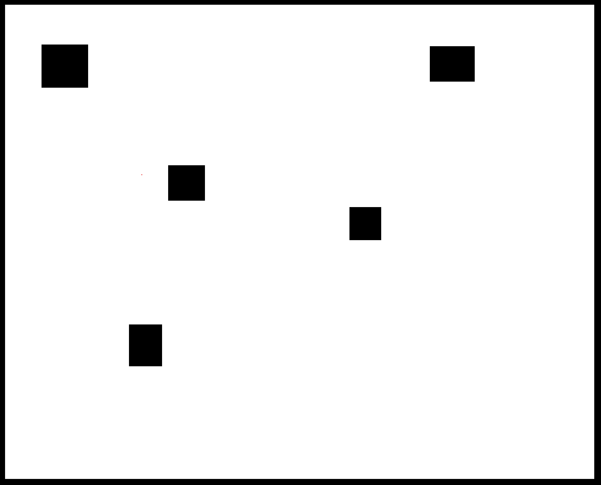

# Find the black tile

Author: Hank Xu

Design: Tried to get something going, but really can't figure out anything about networking. Ended up spending time on integrating stuff with compute shaders :)

Networking: The idea was for the server to transmit the map state in a sequence of [index, positionX, positionY] in a total of 17 bytes. (1 byte index + 2x8 byte x-y coordinates). The player transmits moves as built in.

Screen Shot:

How To Play:

Nothing really. Sorry!

This game was built with [NEST](NEST.md).

